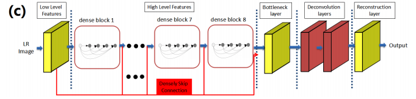
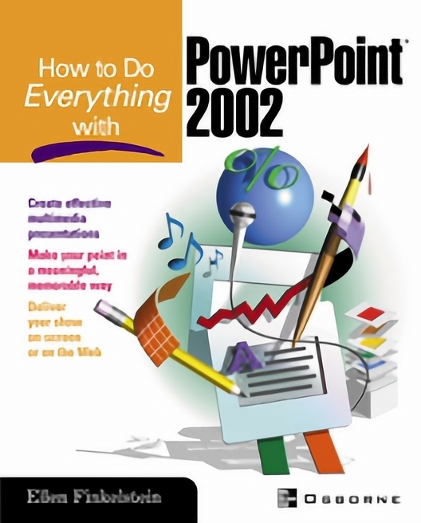

# SRDenseNet

This repository is implementation of the ["Image Super-Resolution Using Dense Skip Connections"](http://openaccess.thecvf.com/content_ICCV_2017/papers/Tong_Image_Super-Resolution_Using_ICCV_2017_paper.pdf).

<center></center>

## Requirements

- PyTorch 1.0.0
- Numpy 1.15.4
- Pillow 5.4.1
- h5py 2.8.0
- tqdm 4.30.0

## Train

The coco2017 50K, Set5 dataset converted to HDF5 can be downloaded from the links below.

| Dataset | Scale | Type | Link |
|---------|-------|------|------|
| coco2017 50K | 4 | Train | [Download](https://www.dropbox.com/s/9fg2oxxezwrspcg/coco2017_x4.h5?dl=0) |
| Set5 | 4 | Eval | [Download](https://www.dropbox.com/s/dkcwr71tqanvyv7/Set5_x4.h5?dl=0) |

Otherwise, you can use `prepare.py` to create custom dataset.

```bash
python train.py --train-file "BLAH_BLAH/coco2017_x4.h5" \
                --eval-file "BLAH_BLAH/Set5_x4.h5" \
                --outputs-dir "BLAH_BLAH/outputs" \
                --scale 4 \  # Only scale factor 4 can be used.
                --lr 1e-4 \
                --batch-size 16 \
                --num-epochs 60 \
                --num-workers 8 \
                --seed 123                
```

## Test

Pre-trained weights can be downloaded from the links below.

| Model | Scale | Link |
|-------|-------|------|
| SRDenseNet_All | 4 | [Download](https://www.dropbox.com/s/wbzynzew6k2e7gc/srdensenet_x4.pth?dl=0) |

The results are stored in the same path as the query image.

```bash
python test.py --weights-file "BLAH_BLAH/srdensenet_x4.pth" \
               --image-file "data/ppt3.bmp" \
               --scale 4
```

## Results

PSNR was calculated on the Y channel.

### Set5

| Eval. Mat | Scale | SRDenseNet_All (Paper) | SRDenseNet_All (Ours) |
|-----------|-------|-------|-----------------|
| PSNR | 4 | 32.02 | 31.80 |

<table>
    <tr>
        <td><center>Original</center></td>
        <td><center>BICUBIC x4</center></td>
        <td><center>SRDenseNet x4 (22.94 dB)</center></td>
    </tr>
    <tr>
    	<td>
    		<center></center>
    	</td>
    	<td>
    		<center></center>
    	</td>
    	<td>
    		<center></center>
    	</td>
    </tr>
    <tr>
        <td><center>Original</center></td>
        <td><center>BICUBIC x4</center></td>
        <td><center>SRDenseNet x4 (27.19 dB)</center></td>
    </tr>
    <tr>
    	<td>
    		<center></center>
    	</td>
    	<td>
    		<center></center>
    	</td>
    	<td>
    		<center></center>
    	</td>
    </tr>      
</table>
